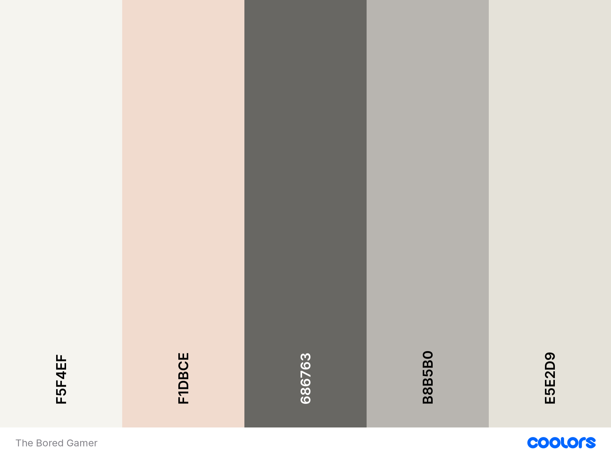

# The Bored Gamer Cafe Website

The Bored Gamer Cafe Website has been designed to work on any device for better user experience. It is very simple to navigate through the navbar located in the top right corner.

<-Screenshot of the responsive website->

Deployed project can be viewed here [The Bored Gamer Cafe](https://juliahoban.github.io/the-bored-gamer/).

# Contents

* [User Experience](#user-experience)
    * [Website Overview](#website-Overview)
    * [Website Structure](#website-structure)

* [Design](#design)
   * [Colour Scheme](#colour-scheme)
   * [Fonts](#fonts)
   * [Images](#images)
   * [Features](#features)

* [Technologies Used](#technologies-used)
    * [Languages Used](#languages)
    * [Programs and Libraries Used](#programs-and-libraries-used)

* [Deployment](#deployment)

* [Testing](#testing)
    * [W3C Validator](#w3c-validator)
    * [Solved Bugs](#solved-bugs)
    * [Lighthouse](#lighthouse)

* [Credits](#credits)
    * [Code Used](#code-used)
    * [Media](#media)
    * [Aknowledgements](#aknowledgements)

- - - 

## User Experience

### Website Overview

The Bored Gamer Website has been created for the board game enthusiasts, for people who enjoy getting together and socialise whilst playing a game. The website is very simple to navigate and relevant information can be easily found.

### Website Structure

The header of the website shows the name of the cafe and a navigation bar.
Home page displays a hero image of the group of people enjoying the game with the text over it and a list of why people should visit the cafe, contact details and location map.
Board Game Hire page shows the price list for different group sizes, how board game hire works and how to book a table or a room.
There is also a Competition Entry page whis has got a form to complete, asking questions like contact details, age and a favourite board game genre.
There is also a footer where the social media pages can be found.

## Design

### Colour Scheme

The above vintage colour palette from [Coolors Website](https://coolors.co/) along with Burnt Sienna has been used throughout The Bored Gamer website.

### Fonts

Mainly Roboto font has been used throughout the website with different styles and weights applied. The "cafe" word in the header has been styled using Satisfy font. Both fonts have been imported from [Gooogle Fonts Website](https://fonts.google.com/).

### Images

There are four images in total used throughout the website, all have been downloaded from [Pexels Website](https://www.pexels.com/). Images have also been compressed to png format to allow for a better Lighthouse performance score.

### Features

## Technologies Used

### Languages Used

The website has been built using purely HTML and CSS.

### Programs and Libraries Used
 
 * Git - for version control
 * Github - to save and store the website files
 * Google Fonts - to import chosen fonts
 * Font Awesome - to import chosen text icons
 * Chrome Dev Tools - to identify and fix bugs
 * [Favicon Generator](https://realfavicongenerator.net/) - to create a favicon
 * [TinyPNG](https://tinypng.com/) - to compress images for better performance

## Deployment

## Testing

### W3C Validator

### Solved Bugs

### Lighthouse

## Credits

### Code Used

### Media

### Aknowledgements