# The Bored Gamer Cafe Website

The Bored Gamer Cafe Website has been designed to work on any device for better user experience. It is very simple to navigate through the navbar located in the top right corner.

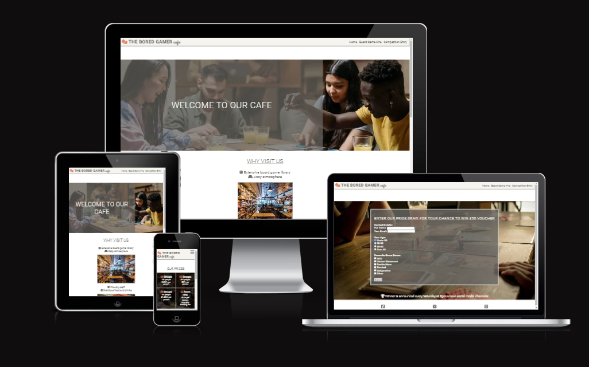

Deployed project can be viewed here [The Bored Gamer Cafe](https://juliahoban.github.io/the-bored-gamer/).

# Contents

* [User Experience](#user-experience)
    * [Website Overview](#website-overview)
    * [User Stories](#user-stories)

* [Design](#design)
   * [Colour Scheme](#colour-scheme)
   * [Fonts](#fonts)
   * [Images](#images)
   * [Features](#features)
   * [Future Implementations](#future-implementations)

* [Technologies Used](#technologies-used)
    * [Languages Used](#languages-used)
    * [Programs and Libraries Used](#programs-and-libraries-used)

* [Deployment](#deployment)

* [Testing](#testing)
    * [W3C Validator](#w3c-validator)
    * [Solved Bugs](#solved-bugs)
    * [Lighthouse](#lighthouse)

* [Credits](#credits)
    * [Code Used](#code-used)
    * [Content](#content)
    * [Media](#media)
    * [Aknowledgements](#aknowledgements)

- - - 

## User Experience

### Website Overview

The Bored Gamer Website has been created for the board game enthusiasts, for people who enjoy getting together and socialise whilst playing a game. The website is very simple to navigate and relevant information can be easily found.

### User Stories

Users would benefit from visiting The Bored Gamer website by being able to find out why it would be a good idea to visit the cafe, what is the location, (map has been included for easier access). Board Game Hire page also shows the price list and has a booking form, which is easy to use. There is also a competition entry page, where, by submitting the form, a user can win a voucher to spend in store. There are also links to The Bored Gamer social media channels, where by clicking a link, a user can find out more information about the cafe and all it has to offer.

## Design

### Colour Scheme

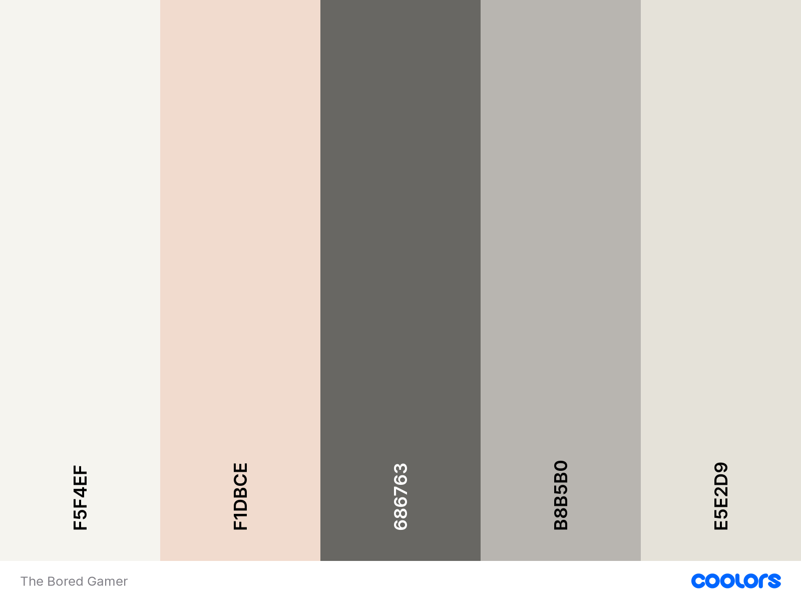

The above vintage colour palette from [Coolors Website](https://coolors.co/) along with Burnt Sienna has been used throughout The Bored Gamer website.

### Fonts

Mainly Roboto font has been used throughout the website with different styles and weights applied. The "cafe" word in the header has been styled using Satisfy font. Both fonts have been imported from [Gooogle Fonts Website](https://fonts.google.com/).

### Images

There are six images in total used throughout the website, all have been imported from [Pexels Website](https://www.pexels.com/). Images have also been compressed to webp format and resized to allow for a better Lighthouse performance score.

### Features

The Bored Gamer website consists of 4 pages: Home page, Board Game Hire Page, Competition Entry page and 404 Error page, which is hidden and would only be displayed if a user enters the name of the website incorrectly.

**The Header**

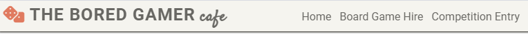

The header of the website shows the name of the cafe and a navigation bar. It is fully responsive to work on any device and the navbar collapses into a burger icon when viewed on mobile screens.

**The Footer**

The footer displays three social media clickable links to take the user directly to social media pages. The footer is fully responsive to work on any device.

**Home Page**

This page has three sections and, also, an imported map.

- **Hero Image Section**

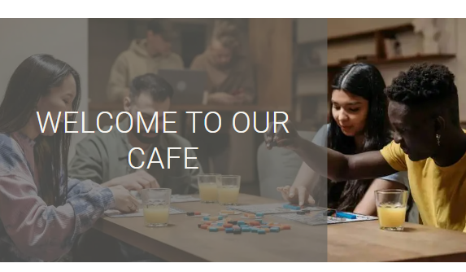

Hero image welcomes the user with the "Welcome to Our Cafe" message and a photo of a group of people enjoying the game.

- **Why Visit Us Section**

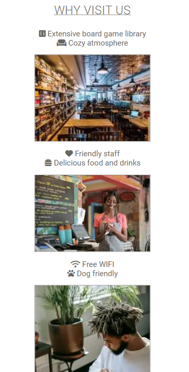

This section shows a list of reasons why the cafe is worth visiting, showing the photos to interest the user further.

- **Contact Us Section**

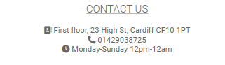

This section displays the contact details for the cafe, including the address, telephone number and opening times.

- **Map**

This part of the Home Page has an imported map from Google Maps to make it easier for visitors to find the location of the cafe.

**Board Game Hire Page**

This page has been split into two sections, Our Prices and a Booking Form.

- **Our Prices**

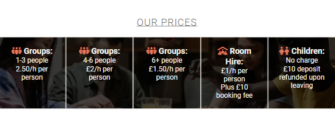

This section shows the price list, which would be useful to the users to know how much they may potentially spend depending on the group size.

- **Booking Form**

This section has a booking form asking the user to fill out some details if they wish to make a table or a room.

**Competition Entry Page**

- **Prize Draw Form**

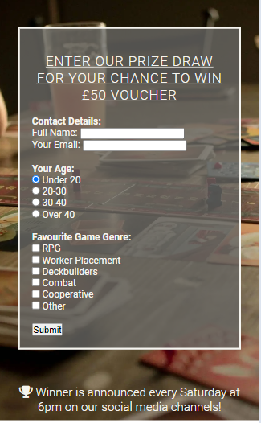

This section has a competition entry form, which a users can fill out by answering some questions if they want to have a chance to win a voucher to spend in the cafe.

**404 Error Page**

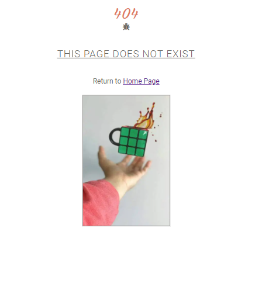

There is also a 404 Error page, which is hidden from users and would only be visible if the name of the page is entered incorrectly.

### Future Implementations

* Use JavaScript to add alt text to background images for screenreaders assistance
* Add an online store to the website to allow visitors buy board games
* Make the website more interactive by using JavaScript

## Technologies Used

### Languages Used

The website has been built using purely HTML and CSS languages.
Markdown language has been used to create README file.

### Programs and Libraries Used
 
 * Git - for version control
 * Github - to save and store the website files
 * Gitpod - to write and edit the code
 * Google Fonts - to import chosen fonts
 * Font Awesome - to import chosen text icons
 * Chrome Dev Tools - to identify and fix bugs
 * [Favicon Generator](https://realfavicongenerator.net/) - to create a favicon
 * [TinyPNG](https://tinypng.com/) - to compress images for better performance

## Deployment

The Bored games website has been deployed through Github following these steps:

1. Find the relevant repository
2. Click "Settings" in the top right corner of the bar
3. On the left side, select "Pages"
3. Set Source as "Deploy from Branch"
4. Select "Main Branch"
5. Set folder to "root"
6. Click "Save"
7. Return to your repository and refresh your page after a few moments.
8. Click on "github-pages" and click "View Deployment"
9. Your deployed project is now visible

## Testing

All website pages have been tested on Chrome, Microsoft Edge and Safari Browsers.

### W3C Validator

All pages have been tested using W3C validator for both HTML and CSS code with only minor errors found, which have since been fixed.

**HTML Validation**

- **Home Page**

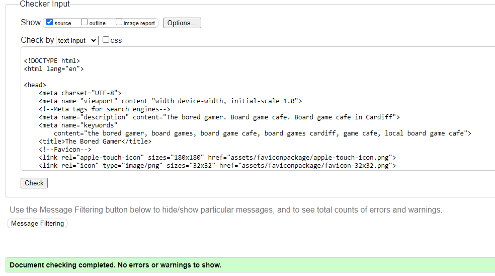

- **Board Game Hire Page**

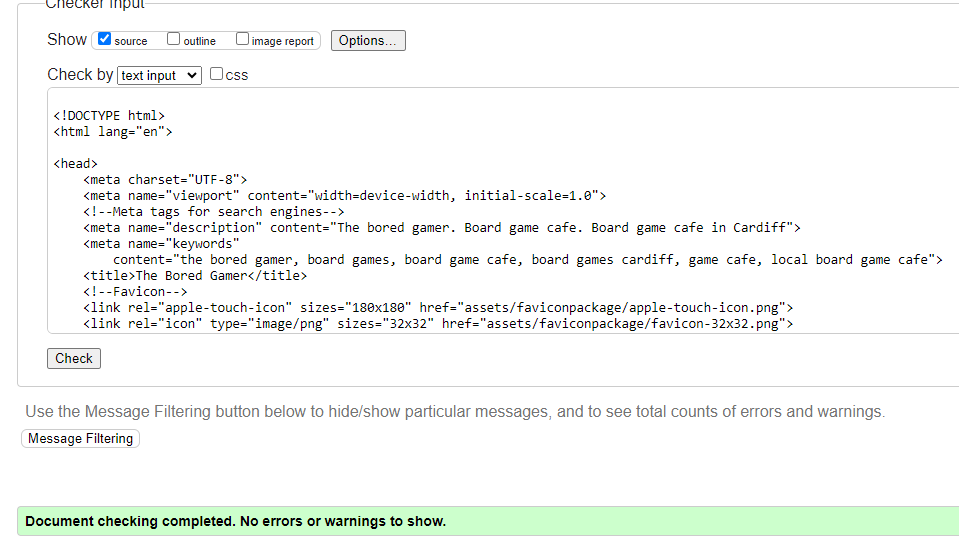

- **Competition Entry Page**

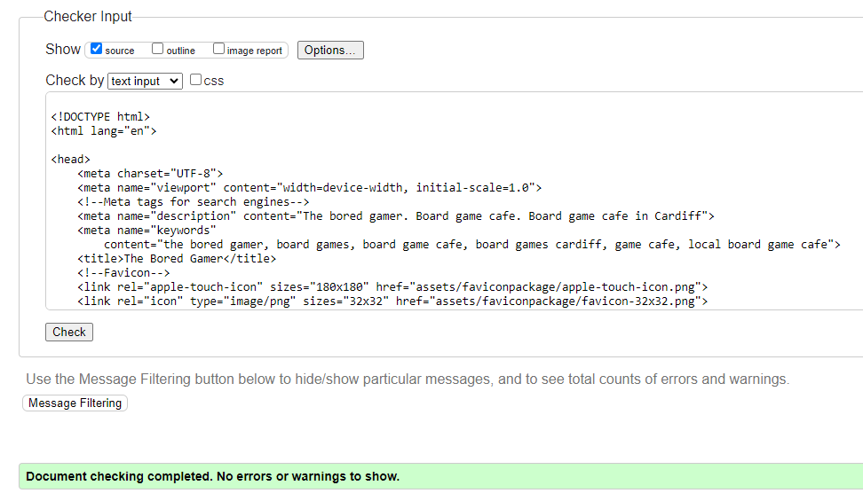

- **404 Error Page**

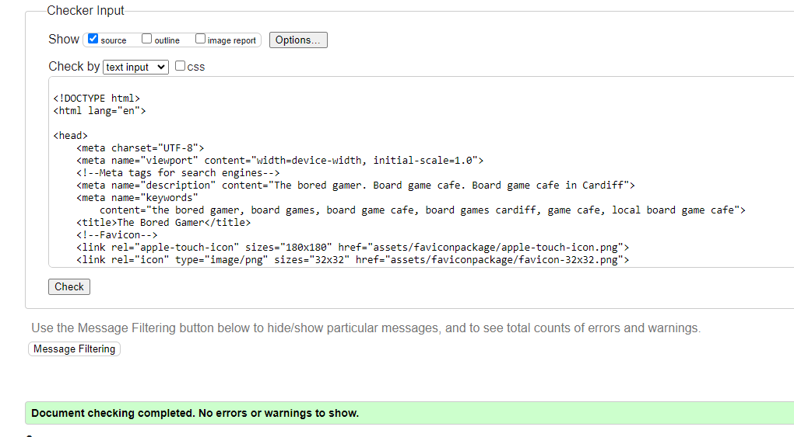

**CSS Validation**

- **CSS Validation All Pages**

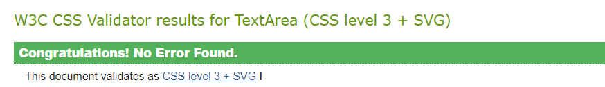

### Solved Bugs

There were numerous bugs throughout the project process, for example the navbar contents were not taking the whole width of the footer, which has been solved by usng flexbox properties.
Most of the bugs were related to website responsiveness not behaving in a desired manner, however, these bugs have been fixed using Media Queries for tablets and larger screens.

### Lighthouse

Every page of the website has been tested for Lighthouse scores for both desktop and mobile screens and the scores are as follows:

**Desktop**

- **Home Page**

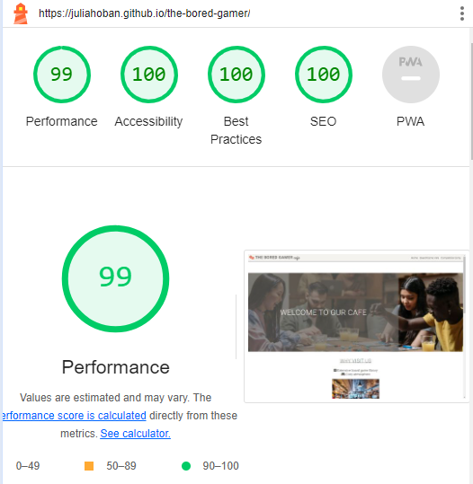

- **Board game Hire Page**

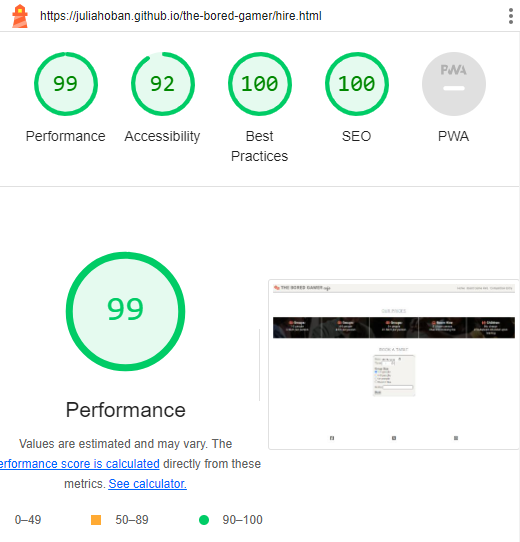

- **Competition Entry Page**

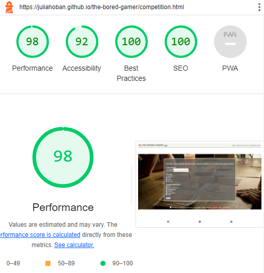

- **404 Error Page**

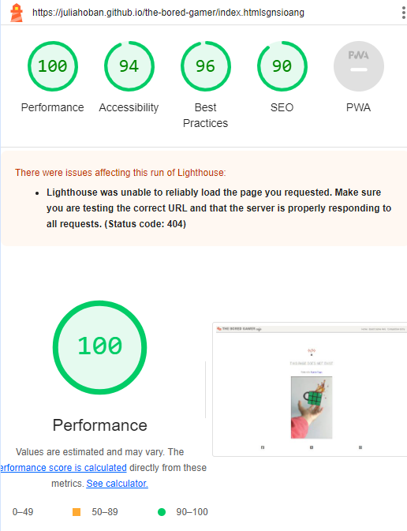

**Mobile**

- **Home Page**

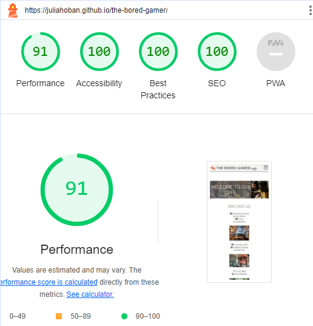

- **Board game Hire Page**

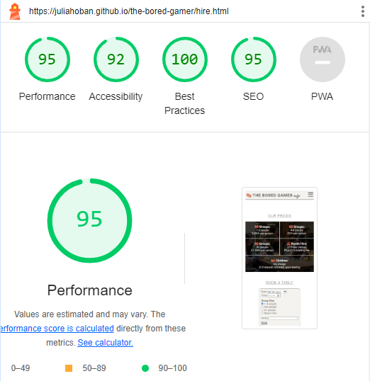

- **Competition Entry Page**

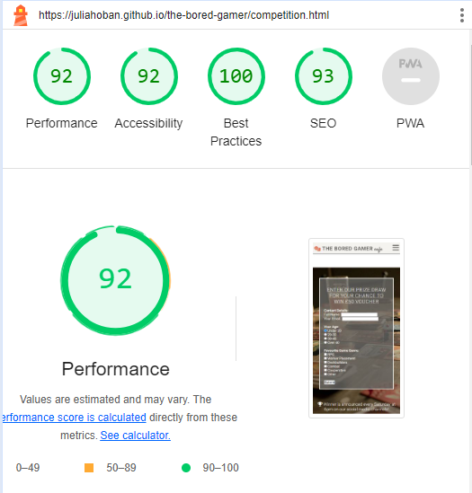

- **404 Error Page**

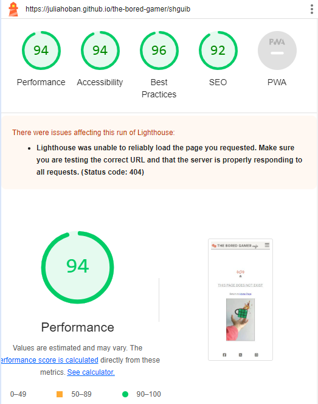

## Credits

### Code Used

The following HTML and CSS code has been adopted from the ""Love Running" project to create a navbar.

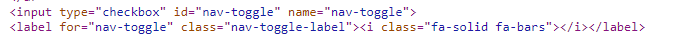

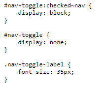

### Content

All written content has been created by myself.
I have, also, taken an inspiration from [Love Running project](https://juliahoban.github.io/love-running/) to organise the pages and for the website to look good by applying CSS code.

### Media 

**Images**

All images have been imported from [Pexels Website](https://www.pexels.com/)

### Aknowledgements

I would like to thank [Kera Cudmore](https://github.com/kera-cudmore) for her inspiration on how to write a README file, my mentor [Graeme Taylor](https://github.com/G-Taylor) for his continuous support and guidance, Code Institute programme creators for the incredible learning materials, and, of course, my felllow students for answering as many questions as they could along the way!

[Back to Contents](#contents)
