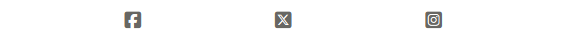
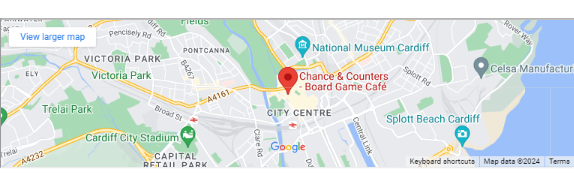
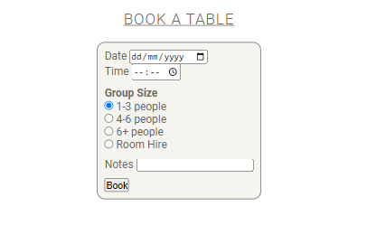

# The Bored Gamer Cafe Website

The Bored Gamer Cafe Website has been designed to work on any device for better user experience. It is very simple to navigate through the navbar located in the top right corner.

Deployed project can be viewed here [The Bored Gamer Cafe](https://juliahoban.github.io/the-bored-gamer/).

# Contents

* [User Experience](#user-experience)
    * [Website Overview](#website-overview)
    * [User Stories](#user-stories)

* [Design](#design)
   * [Colour Scheme](#colour-scheme)
   * [Fonts](#fonts)
   * [Images](#images)
   * [Features](#features)

* [Technologies Used](#technologies-used)
    * [Languages Used](#languages)
    * [Programs and Libraries Used](#programs-and-libraries-used)

* [Deployment](#deployment)

* [Testing](#testing)
    * [W3C Validator](#w3c-validator)
    * [Solved Bugs](#solved-bugs)
    * [Lighthouse](#lighthouse)

* [Credits](#credits)
    * [Code Used](#code-used)
    * [Media](#media)
    * [Aknowledgements](#aknowledgements)

- - - 

## User Experience

### Website Overview

The Bored Gamer Website has been created for the board game enthusiasts, for people who enjoy getting together and socialise whilst playing a game. The website is very simple to navigate and relevant information can be easily found.

### User Stories

Users would benefit from visiting The Bored Gamer website by being able to find out why it would be a good idea to visit the cafe, what is the location, (map has been included for easier access). Board Game Hire page also shows the price list and has a booking form, which is easy to use. There is also a competition entry page, where, by submitting the form, a user can win a voucher to spend in store. There are also links to The Bored Gamer social media channels, where by clicking a link, a user can find out more information about the cafe and all it has to offer.

## Design

### Colour Scheme

The above vintage colour palette from [Coolors Website](https://coolors.co/) along with Burnt Sienna has been used throughout The Bored Gamer website.

### Fonts

Mainly Roboto font has been used throughout the website with different styles and weights applied. The "cafe" word in the header has been styled using Satisfy font. Both fonts have been imported from [Gooogle Fonts Website](https://fonts.google.com/).

### Images

There are six images in total used throughout the website, all have been imported from [Pexels Website](https://www.pexels.com/). Images have also been compressed to png format and resized to allow for a better Lighthouse performance score.

### Features

The Bored Gamer website consists of 4 pages: Home page, Board Game Hire Page, Competition Entry page and 404 Error page, which is hidden and would only be displayed if a user enters the name of the website incorrectly.

**The Header**

The header of the website shows the name of the cafe and a navigation bar. It is fully responsive to work on any device and collapses into a burger icon when viewed on mobile screens.

**The Footer**

The footer displays three social media clicable links to take the user directly to social media pages. The footer is fully responsive to work on any device.

**Home Page**

This page has three sections and, also, an imported map.

- **Hero Image Section**

Hero image welcomes the user with the "Welcome to Our Cafe" message and a photo of a group of people enjoying the game.

- **Why Visit Us Section**

This section shows a list of reasons why the cafe is worth visiting, showing the photos to interest the user further.

- **Contact Us Section**

This section displays the contact details for the cafe, including the address, telephone number and opening times.

- **Map**

This part of the Home Page has an imported map from Google Maps to make it easier for visitors to find the location of the cafe.

**Board Game Hire Page**

This page has been split into two sections, Our Prices and a Booking Form.

- **Our Prices**

This section shows the price list, which would be useful to the users to know how much they may potentially spend dependind on the group size.

- **Booking Form**

This section ahs a booking form asking the user to fill out some details if they wish to make a table or a room.

**Competition Entry Page**

- **Prize Draw Form**

This section has a competition entry form, which a users can fill out by answering some questions if they want to have a chance to win a voucher to spend in the cafe.

**404 Error Page**

There is also a 404 Error page, which is hidden from users and would only be visible if the name of the page is entered incorrectly.

## Technologies Used

### Languages Used

The website has been built using purely HTML and CSS.

### Programs and Libraries Used
 
 * Git - for version control
 * Github - to save and store the website files
 * Google Fonts - to import chosen fonts
 * Font Awesome - to import chosen text icons
 * Chrome Dev Tools - to identify and fix bugs
 * [Favicon Generator](https://realfavicongenerator.net/) - to create a favicon
 * [TinyPNG](https://tinypng.com/) - to compress images for better performance

## Deployment

## Testing

### W3C Validator

### Solved Bugs

### Lighthouse

## Credits

### Code Used

### Media

### Aknowledgements